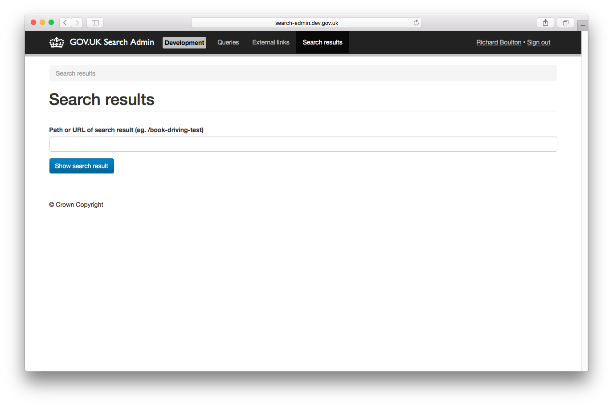

# Search admin

The `search-admin` application manages search "best bets" and "external links" along with other search and browse data.

## Screenshots

## Live example

- https://search-admin.publishing.service.gov.uk/

## Technical documentation

This is a Ruby on Rails application that manages search "best bets" and "external links" along with other search and browse data. It is behind the signon authentication system and doesn't have a public API.

### Dependencies

- [alphagov/publishing-api](https://github.com/alphagov/publishing-api) - search-admin publishes external links to the publishing API
- [alphagov/search-api](https://github.com/alphagov/search-api) - search-admin sends updates to search-api when best bets are edited

### Running the application

`./startup.sh`

The app runs on port 3073. If you're using the dev VM it will be available at http://search-admin.dev.gov.uk/

#### Creating the mysql user

The database.yml for this project is checked into source control so
you'll need a local user with credentials that match those in
database.yml.

    mysql> grant all on `search_admin\_%`.* to search_admin@localhost identified by 'search_admin';

### Running the test suite

`bundle exec rake`

### External links

Run `bundle exec rake publish_external_links:publishing_api` to send all external links to the publishing API.

## Licence

[MIT License](LICENSE)
