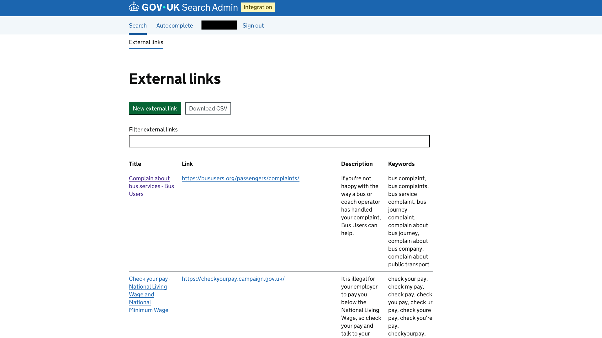

# Search admin

Manages search "external links" and autocomplete "denylist" along with other search and browse data.

## Screenshots



## Live example

- https://search-admin.publishing.service.gov.uk/

## Technical documentation

This is a Ruby on Rails app, and should follow [our Rails app conventions](https://docs.publishing.service.gov.uk/manual/conventions-for-rails-applications.html).

You can use the [GOV.UK Docker environment](https://github.com/alphagov/govuk-docker) to run the application and its tests with all the necessary dependencies. Follow [the usage instructions](https://github.com/alphagov/govuk-docker#usage) to get started.

Some functionality in Search Admin relies on and requires access to Google Cloud Discovery Engine.
When running locally, `govuk-docker` configures the environment to point to the search-api-v2-integration GCP project,
but [authentication](#local-authentication-to-gcp) is required in some cases. Where relevant, these cases are highlighted in the sections that follow.

### Local authentication to GCP

Prerequisites:

1. You must be a member of the integration gcp access google group: govuk-gcp-access-integration@digital.cabinet-office.gov.uk
2. You will need the email address of the custom search-api-v2-integration service account for Search Admin. This is the service account used by Search Admin to authenticate its requests to Discovery Engine running in integration.

The email address can be found under *IAM and admin > Service Accounts* in the __Search API V2 Integration__ project at https://console.cloud.google.com.

Note: There are a few similarly named service accounts. Make sure to select the account used to provide access to "Search Admin (Rails admin app)".

To set up credentials, run:

```bash
gcloud auth application-default login --impersonate-service-account <search-admin service account email address>
```

Revoke credentials when you are finished using them, by running:

```bash
gcloud auth application-default revoke
```

For more details on using the gcloud cli see: https://docs.publishing.service.gov.uk/manual/google-cloud-platform-gcp.html#using-the-cli

### Running search-admin locally

```bash
govuk-docker up search-admin-app
```

> WARNING! Functionality for the autocomplete denylist connects directly from Search Admin to Discovery Engine.
> When changes to the denylist are made, the full copy of the denylist from Search Admin is reimported into Discovery Engine.
> This means that changes to the denylist made during local development can overwrite the denylist in Discovery Engine in integration. 
> This can cause unexpected behaviour as the denylist in Discovery Engine gets out of sync with the denylist saved in the Search Admin database in integration.
> To avoid this, you can make sure you're **not** authenticated to GCP locally before making changes. Alternatively, you can reimport the denylist
> from Search Admin in integration to Discovery Engine to reset it, once you are finished making changes locally.
> Do this by adding and then revoking a new denylist entry from Search Admin in integration.

### Running the test suite

```bash
govuk-docker run bundle exec rake
```

### External links

The rake task `publish_external_links:publishing_api` sends all external links to the publishing API.

### Document rake tasks

These [rake tasks](/lib/tasks/document.rake) use Google Cloud Discovery Engine API to interact with documents in the Agent Search Datastore.

[Authentication to GCP](#local-authentication-to-gcp) is required to run these locally to connect to the GCP search-api-v2-integration project.

The rake tasks can be run using the default `lite` stack, from your search-admin folder:

```bash
govuk-docker run bundle exec rake [relevant-rake-task]
```

## Licence

[MIT License](LICENCE)
