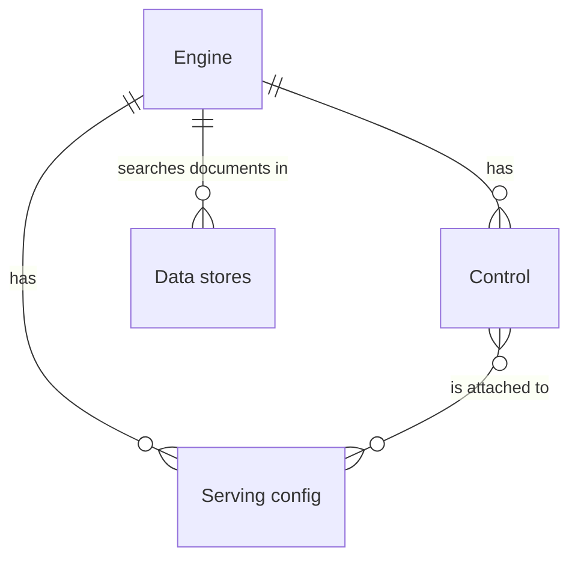

# Customising Discovery Engine ("Vertex AI Search")
One of the core responsibilities of Search Admin is to provide an interface for administrative
users, such as performance analysts, to apply customisations to the way search behaves on GOV.UK.

Our underlying search product, Google Cloud Discovery Engine (better known by its marketing name
Vertex AI Search), provides several API resources that can be used to adapt its behaviour.

We have (for now) chosen to implement a relatively basic CRUD UI to directly manage some of these
API resources on Search Admin, rather than introducing richer domain concepts at a higher level of
abstraction and hiding Discovery Engine's complexity. For example, rather than a feature to remove
specific pages from search results, or allow for "best bets" like in the past, users need awarenes
of how controls and serving configs interact to achieve similar results.

This means Search Admin's domain model is more tightly coupled to the underlying product, and end
users need some knowledge of Discovery Engine's features, but it improves sustainability and reduces
maintenance complexity of the app which may not always be under active development.

## How customisation works
To understand Search Admin's search customisation features, you need to consider the following kinds
of Discovery Engine API resources and their relationships:
* Data stores
* Engines
* Controls
* Serving configs

### Data stores
[Data stores][ds-docs] contain the documents we want to be searchable. In our current architecture,
we have a single data store into which we synchronize (most) content items from GOV.UK. This happens
in a synchronisation worker in [Search API v2][search-api-v2].

### Engines
> [!WARNING]
> Trip hazard: the Google Cloud Console UI and user-facing documentation (unlike the API) refer to
> engines as "apps".

Engines aggregate one or more data stores into a search engine that you can query for documents. For
GOV.UK, we currently have a single engine connected to the single data store (see above).

### Controls
[Serving controls][control-docs] ("controls" for short) are Discovery Engine's main customisation
mechanism. A control is created on an engine and can change its behaviour by either:
* changing how queries are interpreted (for example, by defining synonyms), or
* changing how results are returned (for example, hiding or reranking certain results)

Each control has an "action" that defines its type, and we currently offer the following in Search
Admin:
- **Boosts** allow us to increase or decrease the ranking of some content items in the results by a
  given factor
- **Filters** allow us to remove some content items from the results entirely

Boosts and filters have a "filter expression" written in a Discovery Engine-specific [filter query
language] that allows us to say which content items they apply to. For example, they could apply to
all historic content (`is_historic = 1`), or a specific set of documents by link (`link:
ANY("/example1", "/example2")`).

### Serving config(uration)s
Every engine has at least one serving config(uration). A serving config represents a particular
combination of engine settings (such as which of its controls should be applied), and provides an
endpoint that clients (such as the query API on Search API v2 used by the GOV.UK website/Finder
Frontend) can call to retrieve search results.

This means we can have diferent controls active on different serving configurations. In our case, we
have decided to have a "primary" serving configuration (`govuk_default`) that is used by Search API
v2 for live search requests, as well as a preview configuration (`govuk_preview`) that Search Admin
users can use to try out different controls and a raw configuration (`govuk_raw`) that doesn't apply
any controls at all.

## Implementation
In Search Admin, a `Control` is the main model representing a control on Discovery Engine. It has an
`action` associated using [delegated types], which is represented as a `Control::____Action` model
using the `Control::Actionable` concern with the specific functionality.

The action models are namespaced under the `Control` model to make clear that actions are tightly
coupled to controls, and don't make sense as standalone units.

We also have a `ServingConfig` model that represents a serving config on Discovery Engine, with a
basic `use_case` enum to declare what purpose they serve (whether they are for live search requests,
previewing purposes, or purely internal). As the stable APIs do not yet allow us to create or delete
serving configs, we created the initial set of serving configs through Terraform and have a
`bootstrap:seed_serving_configs` Rake task to create their local database records.

`ServingConfig`s have a many-to-many association with `Control`s through the `ControlAttachment`
join model, and changes are persisted by updating the appropriate Discovery Engine serving config
resource with the new control IDs.

[control-docs]: https://cloud.google.com/generative-ai-app-builder/docs/configure-serving-controls
[ds-docs]: https://cloud.google.com/generative-ai-app-builder/docs/create-datastore-ingest
[delegated types]: https://api.rubyonrails.org/classes/ActiveRecord/DelegatedType.html
[filter query language]:
https://cloud.google.com/generative-ai-app-builder/docs/filter-search-metadata#filter-expression-syntax
[search-api-v2]: https://github.com/alphagov/search-api-v2
